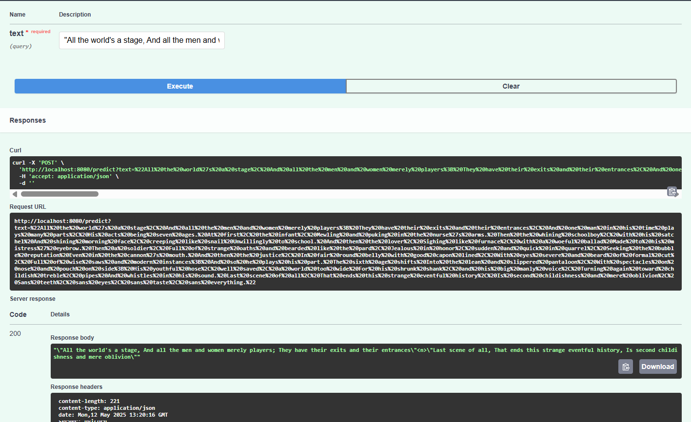

# Text Summarizer 📃MLOps using HuggingFace

End to End implementation machine learning Operations of a text summarizer model by fine-tuning a hugging face model. 

### 🚀 Features

-   💾 **data ingestion**: ingested data from a web url.
-   🔃 **data transformation**: pre-processed the ingested data into an appriopriate format.
-   ➕ **Model model**: Trained, rather fine-tuned the model with the transformed data.
-   ✏️ **Model inference**: Tested an inference API using `fastAPI`.
-   📋 **Clean code structure:** files are structured in a clean and comprehensible way.

### Specifications

-   **The datasets:** Use of a dialogue datasets made up of dialogue, summary, and id.
-   **Model:** Fine-tuned the Seq-to-Seq `pegasus-cnn_dailymail` model by google.
-   **Evaluation:** Evaluated the model performance using  `rouge score`.

### Workflows 

1. Config.yaml
2. Params.yaml
3. Config entity
4. Configuration Manager
5. Update the components    - Data Ingestion, data transformation, model trainer
6. Create our Pipeline      - Training Pipeline , Prediction Pipeline
7. Front end                - APIs:  Training and batch Prediction APIs.

### SwaggeR API Testing

